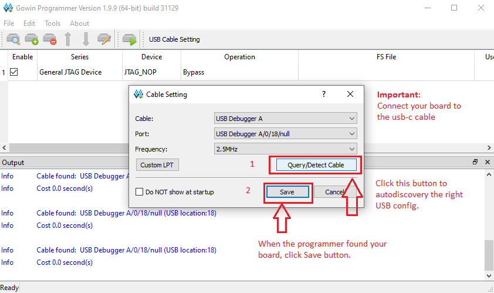
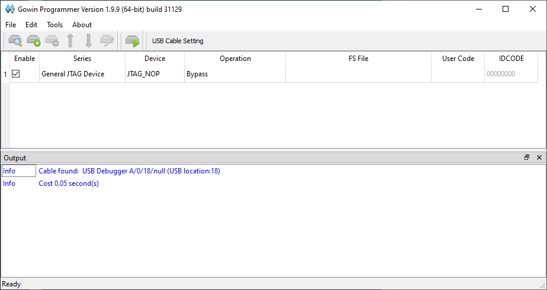
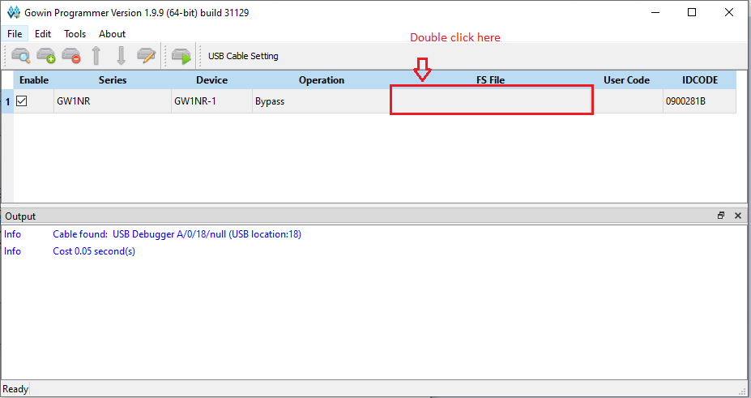
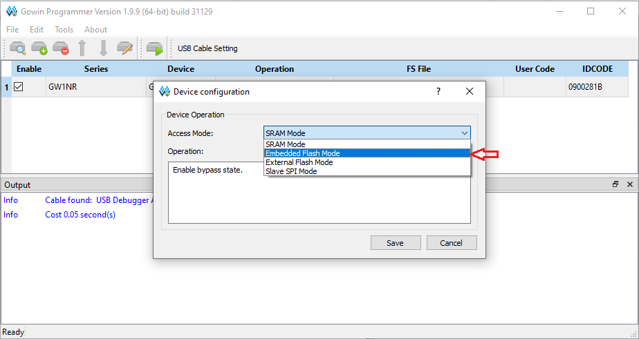
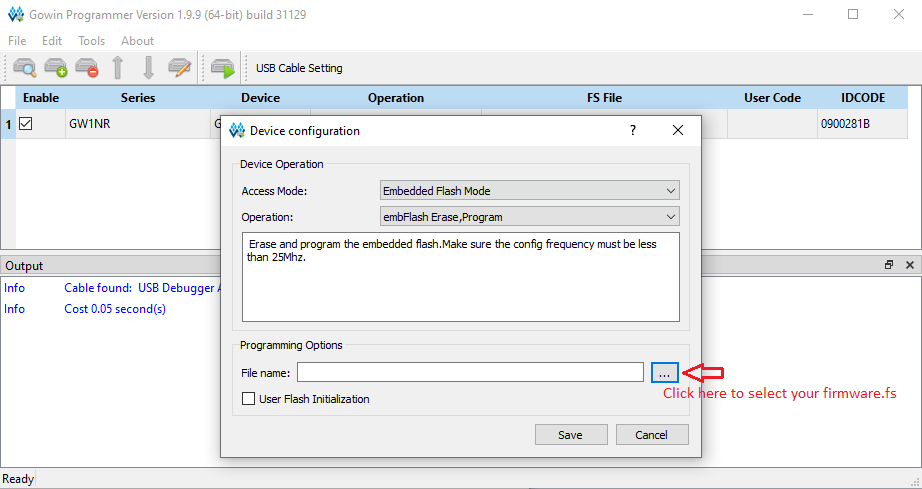
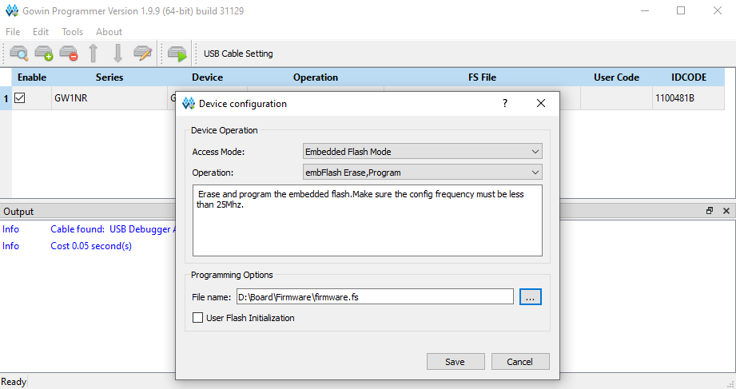
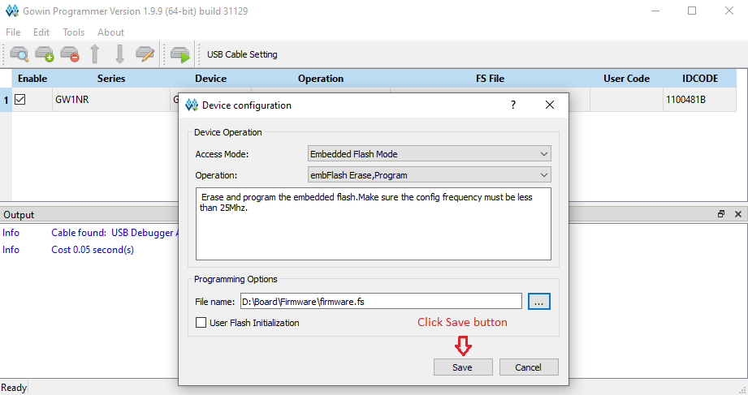
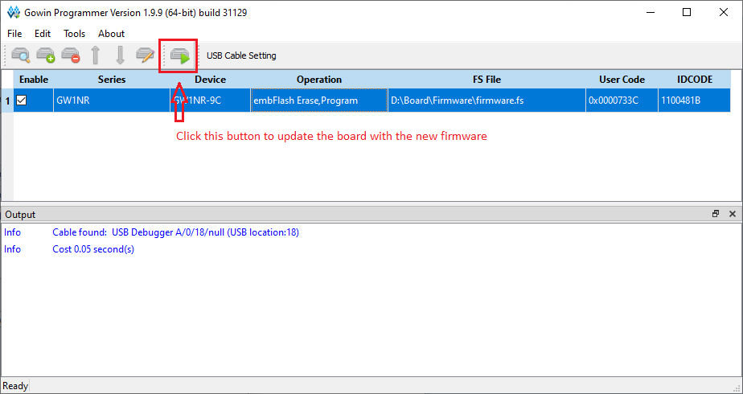
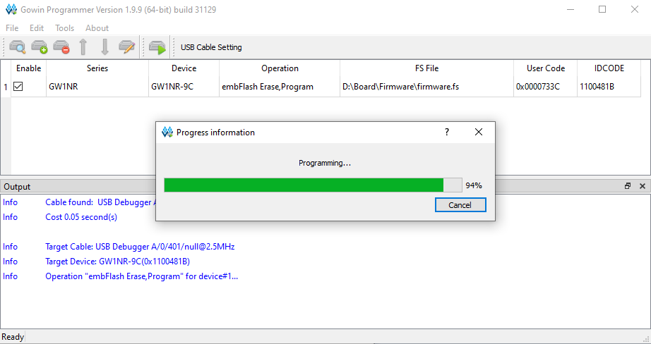
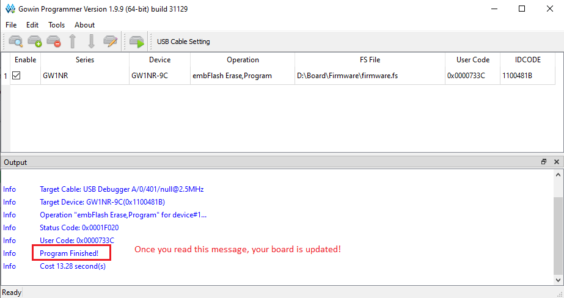

# Gowin Programmer Instructions

USB Cable Setting
-------------

Select your board
-------------

Select Operation: Write to flash
-------------

Save firmware to your board
-------------

